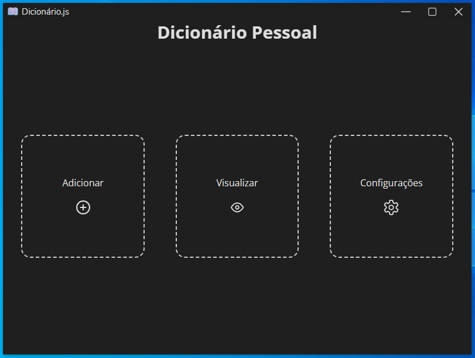

# Dicionario.js

Dicionário simples onde você pode cadastrar as palavras que você aprendeu recentemente, fácil e prático.

## Plataformas

* Windows.
* Linux.

## Funcionalidades

* Adição, Edição e Visualização de palavras/termos e seus significados.
* Atualização automática (Windows).
* Tema claro/escuro.
* Customização do estilo de janela.

## Tecnologias

* Typescript
* Electron
* Electron Store
* [Electron Frame](https://github.com/ArthurLobopro/electron-frame/)
